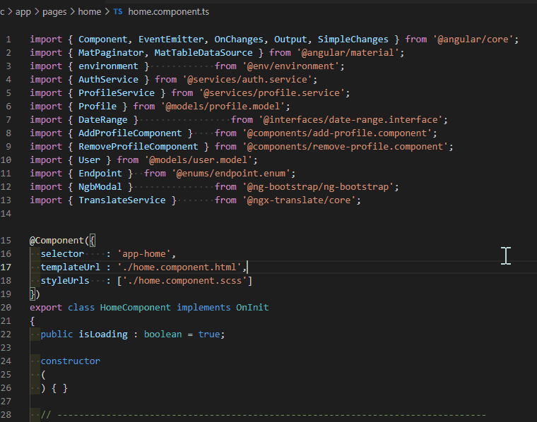

# Classify TypeScript Import - VSCode extension



# Feature breakdown

* Category names and classification rules can be customized
* Default category for all other imports

# Commands

\> **Classify imports**

Reorganizes TypeScript imports based to your configuration.

# Configuration

The default settings come with a classification for the following categories:

**settings.json**
```jsonc
"classify-ts-import.import.groupByOrigin": false,
"classify-ts-import.import.categories": [
  // The order of the categories will be preserved
  {
    "category": "Angular modules",
    "fromContent": "@angular"
    // Javascript importLine.includes('@angular') pattern
  },
  {
    "category": "Ionic modules",
    "fromContent": "ionic"
  },
  {
    "category": "AWS modules",
    "fromContent": "@aws"
  },
  {
    "category": "External modules",
    "fromContent": ""
    // Leave empty for a default category
  },
  {
    "category": "Internal modules",
    "fromContent": ".module, .manager, environment"
    // Comma separated for multiple matching patterns
  },
  {
    "category": "Interfaces",
    "fromContent": ".interface"
  },
  {
    "category": "Directives",
    "fromContent": ".directive"
  },
  {
    "category": "Factories",
    "fromContent": ".factory"
  },
  {
    "category": "Validators",
    "fromContent": ".validator"
  },
  {
    "category": "Guards",
    "fromContent": ".guard"
  },
  {
    "category": "Helpers",
    "fromContent": ".helper"
  },
  {
    "category": "Enums",
    "fromContent": ".enum"
  },
  {
    "category": "Models",
    "fromContent": ".model"
  },
  {
    "category": "Services",
    "fromContent": ".service"
  },
  {
    "category": "Components",
    "fromContent": ".component"
  }
],
```

Of course you can add your own categories as well!

# Development

Start tsc watch using `npm run watch` then press `F5`.

**Unclassified import example**

```ts
import { Component, EventEmitter, OnChanges, Output, SimpleChanges } from '@angular/core';
import { MatPaginator, MatTableDataSource } from '@angular/material';
import type { Ref, ComputedRef } from 'vue';
import { environment }            from '@env/environment';
import { AuthService } from '@services/auth.service';
import { ProfileService } from '@services/profile.service';
import { Profile } from '@models/profile.model';
import { DateRange }                 from '@interfaces/date-range.interface';
import { AddProfileComponent }    from '@components/add-profile.component';
import { RemoveProfileComponent } from '@components/remove-profile.component';
import { User } from '@models/user.model';
import { Endpoint }  from '@enums/endpoint.enum';
import { NgbModal }               from '@ng-bootstrap/ng-bootstrap';
import { TranslateService }       from '@ngx-translate/core';
import { find as _find } from 'lodash';
```

**Result**
```ts
// Angular modules
import { Component }              from '@angular/core';
import { EventEmitter }           from '@angular/core';
import { OnChanges }              from '@angular/core';
import { Output }                 from '@angular/core';
import { SimpleChanges }          from '@angular/core';
import { MatPaginator }           from '@angular/material';
import { MatTableDataSource }     from '@angular/material';

// External modules
import { NgbModal }               from '@ng-bootstrap/ng-bootstrap';
import { TranslateService }       from '@ngx-translate/core';
import { find as _find }          from 'lodash';
import type { Ref }               from 'vue';
import type { ComputedRef }       from 'vue';

// Internal modules
import { environment }            from '@env/environment';

// Interfaces
import { DateRange }              from '@interfaces/date-range.interface';

// Enums
import { Endpoint }               from '@enums/endpoint.enum';

// Models
import { Profile }                from '@models/profile.model';
import { User }                   from '@models/user.model';

// Services
import { AuthService }            from '@services/auth.service';
import { ProfileService }         from '@services/profile.service';

// Components
import { AddProfileComponent }    from '@components/add-profile.component';
import { RemoveProfileComponent } from '@components/remove-profile.component';
```

# TODO
- Test : 
  - `import defaultModule, { otherModule } from '@origin/file';`
  - `import * as lib from 'library';`
- Merge imports by origin if `groupByOrigin`

# Changelog
The changelog can be found [here](CHANGELOG.md)

# Credits

* VSCode extension boilerplate - [tjx666/vscode-extension-boilerplate](https://github.com/tjx666/vscode-extension-boilerplate)